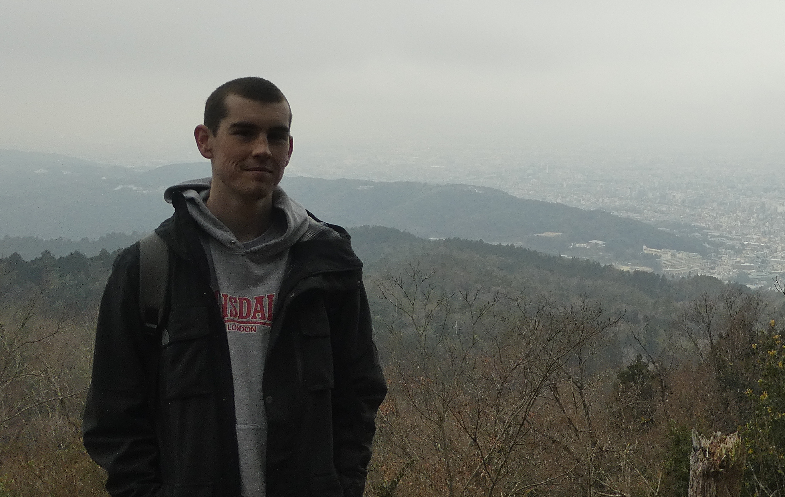

I am a PhD student in computational statistics and applied mathematics at the
University of Western Australia, supervised by 
[Edward Cripps](https://research-repository.uwa.edu.au/en/persons/edward-cripps),
[Thomas Stemler](https://research-repository.uwa.edu.au/en/persons/thomas-stemler), and
[Mark Girolami](https://prof-girolami.uk). I am also affiliated with Mark Girolami's
[Computational Statistics and Machine Learning (CSML)
group](https://csml-cam.github.io) at the University of Cambridge.

My PhD is on developing statistical methodology to deal with uncertainty in
numerical models. See [here](/research/) for more info.

